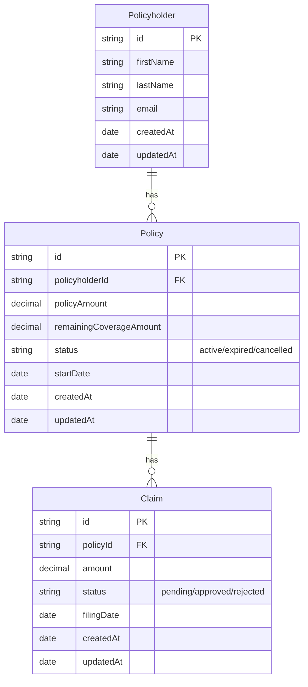

# Updated Claims Management System - Entity Relationship Diagram

```mermaid
erDiagram
    Policyholder ||--o{ Policy : "has"
    Policy ||--o{ Claim : "has"

    Policyholder {
        string id PK
        string firstName
        string lastName
        string email
        date createdAt
        date updatedAt
    }

    Policy {
        string id PK
        string policyholderId FK
        decimal policyAmount
        decimal remainingCoverageAmount
        string status "active/expired/cancelled"
        date startDate
        date createdAt
        date updatedAt
    }

    Claim {
        string id PK
        string policyId FK
        decimal amount
        string status "pending/approved/rejected"
        date filingDate
        date createdAt
        date updatedAt
    }
```
