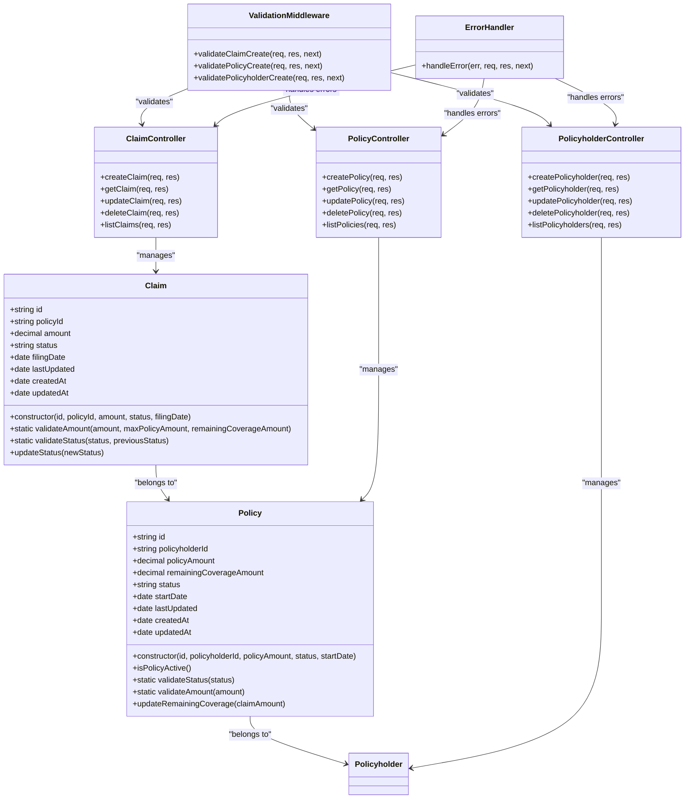

# Updated Claims Management System - Low Level Design

```mermaid
classDiagram
    class Claim {
        +string id
        +string policyId
        +decimal amount
        +string status
        +date filingDate
        +date lastUpdated
        +date createdAt
        +date updatedAt
        +constructor(id, policyId, amount, status, filingDate)
        +static validateAmount(amount, maxPolicyAmount, remainingCoverageAmount)
        +static validateStatus(status, previousStatus)
        +updateStatus(newStatus)
    }

    class Policy {
        +string id
        +string policyholderId
        +decimal policyAmount
        +decimal remainingCoverageAmount
        +string status
        +date startDate
        +date lastUpdated
        +date createdAt
        +date updatedAt
        +constructor(id, policyholderId, policyAmount, status, startDate)
        +isPolicyActive()
        +static validateStatus(status)
        +static validateAmount(amount)
        +updateRemainingCoverage(claimAmount)
    }

    class ClaimController {
        +createClaim(req, res)
        +getClaim(req, res)
        +updateClaim(req, res)
        +deleteClaim(req, res)
        +listClaims(req, res)
    }

    class PolicyController {
        +createPolicy(req, res)
        +getPolicy(req, res)
        +updatePolicy(req, res)
        +deletePolicy(req, res)
        +listPolicies(req, res)
    }

    class PolicyholderController {
        +createPolicyholder(req, res)
        +getPolicyholder(req, res)
        +updatePolicyholder(req, res)
        +deletePolicyholder(req, res)
        +listPolicyholders(req, res)
    }

    class ValidationMiddleware {
        +validateClaimCreate(req, res, next)
        +validatePolicyCreate(req, res, next)
        +validatePolicyholderCreate(req, res, next)
    }

    class ErrorHandler {
        +handleError(err, req, res, next)
    }

    Claim --> Policy : "belongs to"
    Policy --> Policyholder : "belongs to"
    ClaimController --> Claim : "manages"
    PolicyController --> Policy : "manages"
    PolicyholderController --> Policyholder : "manages"
    ValidationMiddleware --> ClaimController : "validates"
    ValidationMiddleware --> PolicyController : "validates"
    ValidationMiddleware --> PolicyholderController : "validates"
    ErrorHandler --> ClaimController : "handles errors"
    ErrorHandler --> PolicyController : "handles errors"
    ErrorHandler --> PolicyholderController : "handles errors"
```
